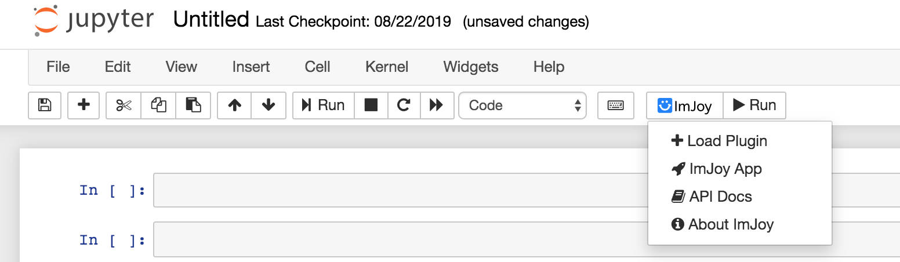

ImJoy Jupyter Extension
============
Try the demo here: [](https://mybinder.org/v2/gh/imjoy-team/imjoy-binder-image/master?filepath=imjoy-jupyter-tutorial.ipynb)


## Using ImJoy with Jupyter notebooks

The imjoy-rpc library enables bidirectional RPC calls between the ImJoy core and your python plugin.

The library has an abstract transport interface that can support different types of transport. For now, we support [Jupyter comms message](https://jupyter-notebook.readthedocs.io/en/stable/comms.html) which is a custom message protocol used in Jupyter notebooks (for example powers jupyter widgets).

To use it, you need to install the imjoy-rpc library in Python and the notebook extension in javascript.

### Install ImJoy RPC and Jupyter notebook extension
```bash
pip install -U imjoy-rpc imjoy-jupyter-extension
```

### Use ImJoy plugins inside Jupyter notebooks
Now you can start a jupyter notebook via for example `jupyter notebook` command, you should be able to see an ImJoy icon in the toolbar if everything goes well.



Now run ImJoy plugins in a cell, see an example that uses itk-vtk-viewer to visualize images:
```python
import imageio
import numpy as np
from imjoy_rpc import api

class ImJoyPlugin():
    def setup(self):
        api.log('plugin initialized')

    async def run(self, ctx):
        viewer = await api.showDialog(type="itk-vtk-viewer",
                                      src="https://oeway.github.io/itk-vtk-viewer/")
        # show a 3D volume
        image_array = np.random.randint(0, 255, [10,10,10], dtype='uint8')
        
        # show a 2D image
        # image_array = imageio.imread('imageio:chelsea.png')

        await viewer.imshow(image_array)

api.export(ImJoyPlugin())
```

With the above code, you created an ImJoy plugin. To run it, click the Run button with the ImJoy icon. It will then call the run function of your plugin.


 * GIF Demo: [Visualizing 2D image](https://ibb.co/XDFF5bQ)
 * GIF Demo: [Visualizing 3D volume](https://ibb.co/QXR63XM)
 * GIF Demo: [Load ImageAnnotator](https://ibb.co/0Zyfxkr)

### Run Jupyter notebook inside ImJoy

You can also do the reverse by running a notebook inside ImJoy, to do that, please first create an empty jupyter notebook. Then copy and paste the url into the "+ PLUGINS" dialog, press enter and install the plugin. Click the newly installed plugin and you will get a notebook page open in ImJoy. 

Try to copy and paste the itk-vtk-viewer example to a cell and execute it. Similarily, if you now click the run ImJoy button in the toolbar, you will get the viewer open insided ImJoy.
